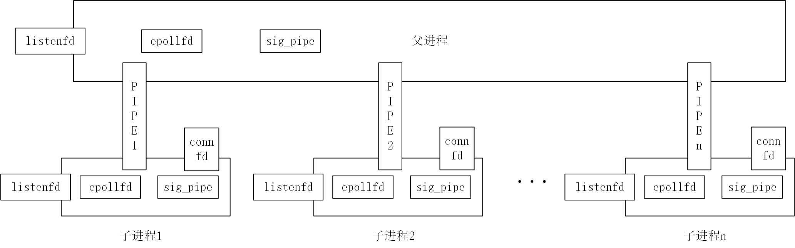

1. tcp连接建立后，数据是如何传送的  
一旦连接建立，客户端向服务器的80端口发送数据时，数据经过网络协议栈到达服务端的网卡。服务端的操作系统会根据数据包中的源地址和源端口信息（客户端的地址和端口），确定是哪个连接与之对应，进而转发给相应连接socket。

2. 多进程下，半同步半异步模型（监听和连接socket由不同进程完成），数据传递   
当客户把数据发送到服务器网卡上以后，服务器的操作系统根据源ip和源port，确定要转发到哪个连接socket上，他先找到是哪个子进程打开的这个连接socket（这通常涉及到在内核中维护的连接信息，监听socket和连接socket和客户端的socket共同标识了一个连接），再把数据发送给这个进程的这个特定socket（端口）。

3. 多进程下的socket架构

4. 每个进程都有一个指向进程池对象的指针，这些进程池对象是相互对立的	