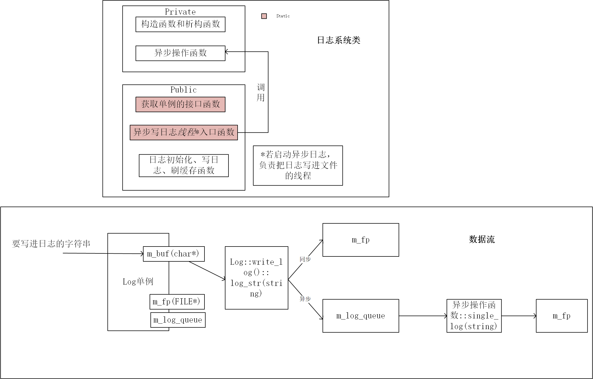

block_queue.h：  
1. 阻塞队列默认大小为1000，阻塞队列的数据结构为循环数组。
2. 用生产者消费者模型共享阻塞队列
+ push操作为生产
+ pop操作为消费  
3. 实现多线程安全（多线程访问共享队列中的元素不会乱），通过条件变量和互斥量实现的。
4. 赋值运算符与拷贝构造
+ 当使用赋值运算符进行赋值时，如果右侧是另一个对象，那么赋值运算符会调用对象的拷贝构造函数来创建一个右侧对象的副本。
+ 如果没有自定义赋值运算符，编译器会生成一个默认的赋值运算符，该赋值运算符简单地对每个成员执行逐个赋值。这可能涉及到调用成员的拷贝构造函数。  
```cpp
bool push(const T& item) {
    // ...

    m_array[m_back] = item;

    // ...
}

bool pop(T& item) {
    // ...

    item = m_array[m_front];
    
    // ... 
}
```
像上面这样，函数传递进来的是左值引用，item就是左值的一个别名。下面的例子结合调试过程中变量的堆栈地址，说明了这一点。
```cpp
#include <iostream>
#include <string>
using namespace std; 


class block_queue{
public:
    block_queue() : m_front(0) {
        m_array = new string[10];
        m_array[0] = "aaa";
    }

    bool pop(string& item) { // &item:0x61fdd0
        // ...

        item = m_array[m_front];  // 这里会调用 T 类型的拷贝构造函数

        // ...

        return true;
    }

private:
    string* m_array; // 0x 61fdf0 - 0x61fdf8 8字节的一个指针，指向的地址为0x f81e78为堆空间的内存。
    int m_front; // 0x 61fdf8 - 0x61fdfc 4字节的int
};


int main() {
    // 调用 pop 函数
    std::string log_str; // 0x 61fdd0 - 0x61fdf0
    bool result = block_queue().pop(log_str);
}
```

log.h:  
1. 单例模式实现日志系统
+ 私有化构造函数，防止外界访问
+ 静态指针指向唯一实例
+ public静态方法（静态方法才能访问静态变量），提供外界获取实例的途径
+ 双锁检测的单例模式（有缺陷：p = new singleTon();无法保证原子性）
```cpp
static singleTon* p;

static singleTon* getInstance() {
    if (···) {
        ···
        if (···) {
            p = new singleTon();
        }
    }
}
```
+ C11后，使用静态局部变量，指向唯一实例（即本项目用的方法）。新的C++标准规定了当一个线程正在初始化一个变量的时候，其他线程必须得等到该初始化完成以后才能访问它，即保证了原子性。在get_instance方法第一次调用时，初始化唯一实例。后续调用get_instance就可以直接返回这个静态局部变量指向的唯一实例。

2. 同步写入的日志系统

3. 异步写入的日志系统
+ 回调函数为什么是static？
    + 因为线程入口函数不能是一个和对象有关的函数（可以通过去掉static看报错得出），static使函数与类有关、与对象无关。
+ 细节处理：异步模式下仍可能同步处理
```cpp
// 即使是异步日志，如果阻塞队列已经满了，仍采用同步方式，防止太多进程睡在阻塞队列上
if (m_is_async && !m_log_queue->full()) {
    m_log_queue->push(log_str);
} else {
    m_mutex.lock();
    fputs(log_str.c_str(), m_fp);
    m_mutex.unlock();
}
```

4. string类型和char*的转化
string类型内部有一个const char* 指针，指向字符串。c_str函数可以返回这个指针给string，实现string-->const char *。而如果把char *赋给string，会调用string的构造函数，实现char *--> string。  
本项目中涉及的语句：
```cpp
log_str = m_buf; // string <-- char*
```

