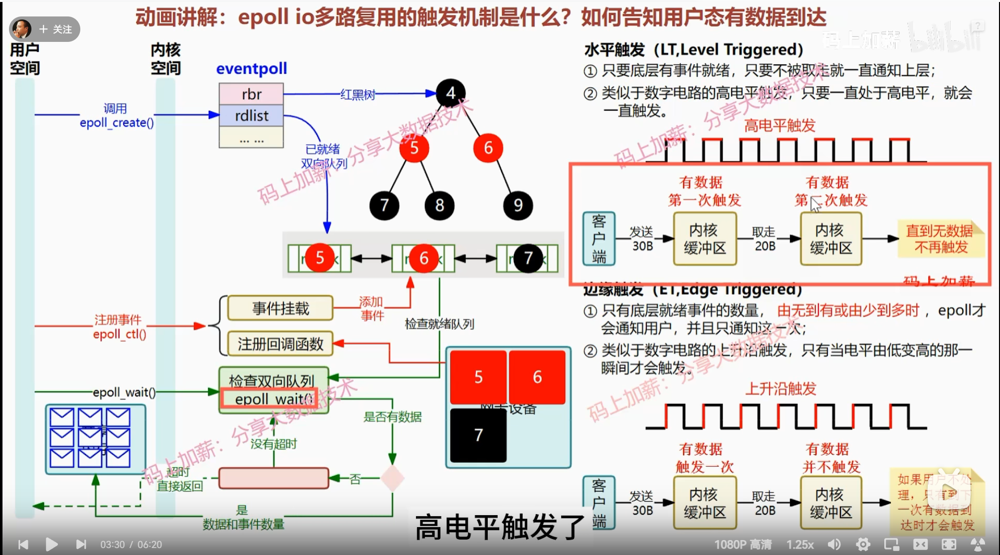

# 构建一个高性能cpp服务器
## 阶段一：通读《Linux高性能服务器编程》
### 一、TCP/IP协议族
#### 数据链路层：  
ARP协议：依靠广播方式，在本地链路上工作，它的工作任务时建立ip地址和mac地址映射。  
#### 网络层：  
IP协议：IP协议根据数据包的目的地址决定发往下一跳。  
ICMP协议：ICMP协议主要用于监测网络连接。一类是差错报文，回应网络错误，如目标不可达；一类是查询报文，ping就是利用它。  
#### 传输层：  
TCP：  

UDP：  
UDP无需保存应用层数据的副本，因为它提供不可靠的服务，数据包发送成功后，UDP内核缓冲区的数据报就被丢弃了。正因为UDP提供不可靠服务，往往上层应用会实现可靠传输，如果需要重传，则应用程序需要重新将用户区的数据拷贝到内核缓冲区。
#### 应用层：  
应用层协议负责应用程序的逻辑，他屏蔽下面几层的实现细节，这部分必须稳定高效，因此他们在**内核中实现**。  
telnet：远程登录协议，本地完成远程任务。  
OSPF：动态路由更新协议。  
DNS：  
应用层协议或程序可能跳过传输层直接使用网络层协议，也可能同时支持TCP和UDP两种传输层协议。  

---  
#### Linux下的一些网络相关命令
抓包  
tcpdump -i eth0 -ent '(dst xxx and src xxx)'  
远程连接主机，同时输出信息
telnet xxx.xx.xx.xx echo  
访问DNS服务器，查询域名ip  
host -t A www.baidu.com
#### Linux下DNS配置相关文件：/etc/resolve.conf
#### socket是操作系统为了向核心态传递数据的系统调用机制
因为数据链路层、网络层、传输层协议都是在内核中实现的，所以操作系统需要实现一组系统调用，是应用程序能访问这些协议提供的服务。  
socket主要实现两个功能：  
+ 将应用程序数据从用户态缓冲区复制到TCP/UDP内核发送缓冲区，以交付内核发送数据。或是反过来从内核读数据。
+ 应用程序可以通过他们修改各层协议的某些头部信息和其他数据结构。比如setsocketopt函数来设置ip数据报在网络上的存活时间。  
### 二、IP协议
#### IP服务的特点：无状态、无连接、不可靠
无状态指不同步状态，IP数据包彼此独立。无连接指通信双方不保存对方信息，所以每次都要声明目的ip源ip。不可靠，即不保证可靠传输，发送失败并不会重传。
### 三、TCP协议
#### TCP协议的流量控制
[指路](https://blog.csdn.net/sinat_30955745/article/details/104848046)

**TCP的socket缓冲区如何接收数据**  
当套接字缓冲区可用空间限制对端窗口大小，TCP套接字缓冲区不可能溢出，因为，因为不允许对端发送超过本段窗口大小的数据。这是TCP的流量控制，如果对端无视TCP的窗口大小而发送超过窗口大小的数据，将丢弃并且不发送ACK。  
**Contrast with UDP**  
对于UDP而言，当接收到的数据报装不进套接字接收缓冲区时，该数据报就会被丢弃。 UDP是没有流量控制的，较快的发送端可以很容易地淹没较慢的接收端，导致接收端的UDP丢 弃数据报。事实上较快的发送端甚至可以淹没本机的网络接口，导致数据报被本机丢弃。  

#### TCP服务特点

**面向链接**  
TCP服务是一对一的，所以基于广播和多播的服务无法使用。广播和多播通常使用无连接服务UDP。  
**字节流服务和数据报服务区别**   
   
体现在实际编程中是通信双方是否执行相同次数的写、读操作。TCP是字节流服务，发送方执行写操作次数和内核中TCP模块发送TCP报文数没有固定数量关系，接受方执行读操作次数与TCP模块接受TCP报文段个数也没有固定数量关系。这就是字节流概念，数据的发送和接受是没有边界概念的。UDP的应用程序，每次执行一次写操作，UDP模块就封装成一个UDP数据报，接收端需要**及时**对每一个数据报执行读操作，否则就会被丢弃。而且如果应用程序的缓冲区大小不足，数据报还会被截断。  
**可靠传输**  

#### TCP头部

头部选项部分，可能包含的信息：  
+ MSS：通常设置为MTU-40B（20B ip头，20B tcp头），表示最大报文段长度，以防止本机ip数据报就被分片。
+ 接受窗口扩大因子：因为头部中接收窗口大小的字段位数限制，为表示更大的接受窗口，设置接受窗口扩大因子，表示原来的大小左移几位。
+ SACK选项：选择性确认选项。防止已经被接受的数据报，因为之前的数据报接收超时而被重传。

#### TCP状态转移
四次挥手中的第三次挥手，客户端收到服务器的（fin、ack）报文段，不会立刻关闭，而是进入TIME_WAIT状态。有两点原因：  
+ 确保客户端的第四次挥手能被服务器收到，这样服务器才能关闭链接，释放资源。  
+ 保证网络上与这次链接有关的所有报文都消失，（等待两个MSL时间），这样，这个连接被重新启用（只相同的ip地址和端口号）时，上次连接的报文不会干扰。

#### TCP拥塞控制
拥塞控制直接的受控变量时发送端一次向网络连续写入的最大值，即SWND（send window）。连续写入，只收到其中第一个数据的确认之前。因为TCP以报文段发送，所以SWND限定了连续发送报文段的数量。  
慢启动（指数增长，慢启动并不慢）--拥塞避免（线性增长）--拥塞控制（判断出网络拥塞，比如收到三个相同的ACK报文，阈值减半）

### 四、访问Internet上的Web服务器
#### 正向代理和反向代理
正向代理是代理客户，客户对因特网的访问发到正向代理服务器，代理服务器代表客户访问互联网。  
反向代理服务器是代理服务端，客户访问代理服务器，好像是访问真正的服务器。
#### TCP连接建立和断开过程中客户端和服务器状态变化


### 五、高级IO API

```cpp
    #include <unistd.h>
    // fd数组用来存放一对文件描述符。pipe是单向管道。
    int pipe(int fd[2]);

    #include <unistd.h>
    // 创建一个指向与原有文件描述符相同文件的文件描述符
    int dup(int file_descriptor);

    #include <sys/uio.h>
    // 将数据从文件描述符读到分散内存块
    ssize_t readv(int fd, const struct iovec* vector, int count);
    // 将数据从分散内存块写到文件描述符
    ssize_t writev(int fd, const struct icvec* vecotr, int count);

    // struct iovec是描述一块内存区的结构体
    // struct ivoc {
    //     void* iov_base; // 起始地址
    //     size_t iov_len; // 长度
    // }

    #include <sys/senfile.h>
    // 在内核中，两个文件描述符直接传递数据（零拷贝）
    // 这是一个专门为网络上传输文件设计的函数，in_fd必须指向真实的文件，不能是pipe或者socket，out_fd必须是socket。
    ssize_t senfile(int out_fd, int in_fd, off_t* offset, size_t count);

    #include <sys/mmap.h>
    // 用来申请一段内存，可以用作进程间通讯的共享内存，也可以把文件之间映射到这个内存
    void* mmap(void* start, size_t length, int prot, int flags, int fd, off_t offset);
    int munmap(void* start, size_t length);

    #include <fcntl.h>
    // 两个文件描述符之间移动数据（零拷贝）
    ssize_t splice(int fd_in, loff_t* off_in, int fd_out, loff_t* off_out, size_t len, unsigned int flags);

    #include <fcntl.h>
    // 和splice类似，只不过来你两个文件描述符都是管道
    ssize_t tee(int fd_in, int fd_out, size_t len, unsighed int flags);

    #include <fcntl.h>
    // 控制文件描述符的函数
    int fcntl(int fd, int cmd,...);
    
```

#### 零拷贝
直接在内核中传递数据，从而避免用户缓冲区和内核缓冲区之间的数据拷贝，效率更高，称为零拷贝。

当谈论指向socket的文件描述符时，对于网络套接字，它实际上指向了内核中的套接字数据结构。

这个套接字数据结构中包含了许多信息，其中就包括了套接字的接收缓冲区和发送缓冲区。这两个缓冲区是用于存储接收和发送的数据的，它们在套接字的生命周期内被动态地管理。当你通过文件描述符进行读取或写入操作时，实际上是在操作这些缓冲区。

### 六、高性能服务器程序框架
#### IO模型中，同步异步、阻塞非阻塞
同步io异步io：io读写由谁来完成。同步io由应用程序完成，异步io由内核完成。同步模型要求用户代码自行io操作（将数据从内核缓冲区读入用户缓冲区，或将数据从用户缓冲区写入内核缓冲区），异步模型io操作由内核完成（数据在内核缓冲区之间的移动，由内核在“后台”完成）。同步io向应用程序通知的是io就绪事件，异步io向应用程序通知（通知方式：信号）的是io完成事件。  
阻塞非阻塞：在事件未发生时，调用线程是否进入阻塞态。  
#### 事件处理模式Reactor和Proacter
reactor：主线程监听文件描述符上是否有事件发生。有的话通知工作线程，工作线程读写数据，接受新连接，处理客户请求。 
+ 同步io实现
 
proactor：主线程监听是否有事件发生，并完成读写数据。工作线程只处理业务逻辑。  
+ 异步io实现，主线程和内核（异步io）完成数据读写，通过信号处理机制（异步io）通知工作线程。

+ 同步io模拟实现，主线程完成数就读写。


#### 两种高效的并发模式（指io处理单元和逻辑单元之间的协调模式）
**半同步/半异步模式**  
同步异步与之前io模型中同步异步不同，同步指完全按照代码序列顺序执行，异步指程序需要系统事件驱动(比如信号处理)。同步线程异步线程都是**单个线程**。

半同步/半异步模式，同步线程用于处理客户逻辑，异步线程处理io事件。
+ 半同步/半反应堆模式  
    + 问题：每个工作线程同时只能处理一个客户链接。
+ 高效的半同步/半异步模式  
    + 每个工作线程可以处理多个工作链接。
    

**领导者/追随者模式**  

#### 监听socket和链接socket是否全部由主线程管理
若是  
+ 则主线程需要向工作线程发送连接socket。对于线程池的实现，这容易实现，因为多线程容易共享文件描述符（相同的文件描述符表）。对于进程池，涉及进程间传递文件描述符。过程如下：
    + 子进程打开文件： 子进程在它的文件描述符表中打开文件，获得一个文件描述符（例如，3）。
    + 文件描述符传递： 子进程将**文件描述符（仅仅是文件描述符，一个整型数）**通过 IPC 机制（管道）传递给父进程。这实际上是将**文件描述符表中的相应项**复制到了父进程的文件描述符表中（传递的是文件描述符，却文件描述符表的相应项也复制过去了，这是通过底层的dup函数实现的）。
    + 父进程访问文件： 父进程现在在它的文件描述符表中也有了一个相同的文件描述符（例如，也是3），它可以使用这个文件描述符来访问同一个文件。  
若不是  
+ 则工作线程可以调用accept函数，主线程只需要管理监听socket。

## 阶段二 牛客网webserver课程
### 一、Linux系统编程入门
#### 静态库的制作和使用

```
// 编译要打包的文件（-c选项不链接）
gcc -c xxx.c xxx.c
// 打包文件
ar rcs libxxx.a xxx.o xxx.o
// 移动生成的静态库到指定文件夹
mv libxxx.a ../lib/
// 编译新文件，使用之前打包的库
gcc main.c -o app -L ../lib/ -l xxx
```

#### 动态库的制作和使用
```
// 编译得到.o文件（需要位置无关代码-fpic）
gcc -c -fpic xxx.c xxx.c
// gcc得到动态库
gcc -shared xxx.o xxx.o -o libxxx.so
// gcc链接时，动态库的代码不会打包到可执行程序中
gcc main.c -o app -L ../lib -l xxx

// 检查可执行文件的动态库依赖
ldd xxx
<!-- 
    在使用 ldd 命令查看共享库依赖关系时，它实际上只是读取可执行文件（或共享库）的头部信息，其中包含了关于共享库的位置信息。这些位置信息包括虚拟地址的基址。
    在可执行文件中，共享库的路径和名称以及一些其他信息（如加载时的选项）被记录在头部。这使得动态链接器在加载时能够找到和加载相应的共享库。
    这里的虚拟地址是在编译和链接时预定的地址，而不是在程序运行时分配的实际地址。当程序运行时，操作系统的动态链接器会将共享库加载到进程的虚拟地址空间中，而不一定是预定的地址。虚拟地址的具体分配是由操作系统进行的，确保每个进程有独立的地址空间。
    所以，即使动态库还没有被加载，ldd 命令也能显示出预定的虚拟地址。这样做的目的是为了在构建可执行文件时，让编译器和链接器知道共享库的位置，以便在程序运行时正确地加载这些库。 
-->
```

#### 如何定位共享库文件
当系统加载可执行代码的时候，能够知道其多依赖的库的名字，但还需要知道绝对路径。此时需要系统的动态载入器（对于elf格式的可执行程序，是ld-linux.so）来获取绝对路径。它先后搜索elf文件的DT_RPATH段--》环境变量LD_LIBRART_PATH--》/etc/ld.so.cache文件列表--》/lib/, /usr/lib 找到库文件后载入内存。

在加载动态库时（程序开始运行时），动态链接器会解析库中的符号引用，将它们映射到程序的地址空间，并解决任何必要的**重定位**。这确保了程序可以正确调用和访问动态库中的函数和数据。

#### makefile
**一些预定义变量**  
CC （default）gcc  
CXX （default）g++  
AR (default) ar  
**\$**  
\$(变量名)：取变量值  
\$@: 取对象值  
\$<: 取第一个依赖文件  
\$^: 取所有依赖文件  
**\%**  
\%: 模式匹配，匹配一个字符串（第二次出现时，表示第一个%匹配的字符串）  
**函数**  
\$(wildcard PATTERN): 获取符合PATTERN指定类型的文件

#### GDB
```
// -g 在可执行文件中插入源代码信息，比如可执行文件中的第几条机器指令对应源代码的第几行
// -Wall 显示所有warning
gcc -g -Wall program.c -o program
```

#### FILE文件与fd文件描述符
FILE文件指针中有三个部分:  
+ 文件描述符  
+ 指向当前文件读写指针的位置  
+ 指向io缓冲区起始位置的指针（虚拟内存地址）  

io缓冲区起到了类似cache的作用，在*用户内存*中的一块空间，减少系统调用与磁盘io次数。  

文件描述符是文件描述符表的索引，文件描述符表保存在进程控制块中（一个进程中可以打开多个文件），大小为1kb。文件描述符表的每一个条目中保存文件操作函数表的指针,文件状态,文件当前偏移,文件被引用次数.

文件描述符0、1、2三个分别对应标准输入文件、标准输出文件、标准错误文件，默认是打开的。每打开一个文件，占用一个文件描述符，而且是空闲的最小文件描述符。  
磁盘是按块存储的，知道盘块号就能找到文件在磁盘中的保存位置。盘块号有索引块inode保存。而从文件描述符表中能找到inode的位置。

### 二、Linux多进程开发
#### 进程的状态转换

```
// 查看进程状态
ps aux
ps ajx
// 显示进程动态
top
```

#### 父子进程虚拟地址使用情况
子进程的虚拟空间是拷贝父进程的，除了各自内核空间中PCB中的pid, ppid不一样, **信号集不一样**，其他都是一样的。在实际的物理内存中，采用写时拷贝技术（读时共享），避免重复资源拷贝造成的资源浪费。  
fork之后的父子进程共享打开的文件，他们**共享**文件描述符表, 文件被引用次数+1.

#### GDB调试多进程
```
// 设置gdb跟踪父进程还是子进程(默认父进程)
set follow-fork-mode 
// 设置fork时,是否脱离gdb跟踪(默认开启)
set detach-on-fork
// 查看当前跟踪的进程(*表示当前调试的进程)
info inferiors
// 切换当前调试的进程
inferior [num]
// 使某进程脱离GDB跟踪
detach inferiors [num]
```

#### exec函数族
exec就是在调用进程内部执行一个可执行文件。exec函数族执行成功不会返回，因为调用进程的实体，包括代码段数据段和堆栈等已经被新的内容取代，只留下进程id等信息保持原样，类似金蝉脱壳。  

#### 程序退出
```cpp
// status是进程退出状态信息,父进程回收子进程资源时可以获取
// 这两个函数都会系统调用,进内核退出程序.
// 程序结束前刷新io缓冲区
#include <stdlib.h>
void exit(int status);
// 程序结束前不会刷新io缓冲区
#include <unistd.h>
void _exit(int status);
```

#### 僵尸进程和孤儿进程区别
孤儿进程是父进程退出后,子进程仍然没有结束,子进程成为孤儿进程,由操作系统接管.孤儿进程对系统没有危害.  
僵尸进程是子进程死后,父进程没有回收资源,子进程内核区的数据没人释放（如进程号、退出状态、运行时间等）,一直占着内存,成为了僵尸进程.  

#### wait()和waitpid()
wait()阻塞，waitpid()可以设置不阻塞。一个wait函数清理一个子进程。
```cpp
#include <sys/types.h>
#include <sys/wait.h>

// 调用wait函数的进程阻塞，直到他的一个子进程收到一个不可忽略的信号
// wstatus: 进程退出时的状态信息, 可以通过一些宏打印这些信息
// 成功返回回收的子进程id，失败返回-1(所有子进程都结束, 调用函数失败).
pid_t wait(int *wstatus);
// 
pid_t wait(pid_t pid, int *wstatus, int options);
```

#### 进程间通信IPC技术
+ 管道  
管道实质上是**内核中**一个有一定存储能力的缓冲区。
一个管道是一个**字节流**，读进程可以从管道中读取任意大小的数据，而不必与写进程每次向管道中写的数据大小保持一致。
管道中的数据是顺序的，且必须顺序访问数据，不可随机访问，数据一经读走就被管道抛弃（环形队列实现）。
管道是单向的（半双工：同一时刻，数据只能朝一个方向流动）。 
管道两端的文件描述符默认是阻塞的。   
读管道：  
$\qquad$管道中有数据，read返回实际读到的字节数  
$\qquad$管道中无数据：  
$\qquad\qquad$写端被全部关闭，read返回0（相当于读到文件末尾）  
$\qquad\qquad$写段没有全部关闭，read阻塞等待  
写管道：  
$\qquad$管道读端全部关闭，进程收到SIGPIPE信号。管道破裂  
$\qquad$管道读端没有全部关闭  
$\qquad\qquad$管道已满，write阻塞  
$\qquad\qquad$管道未满，write将数据写入，返回实际写入的字数 

    + 匿名管道（pipe）  
    匿名管道没有文件实体，可读可写。匿名管道只能在具有公共祖先（父进程和子进程，兄弟进程之间，有亲缘关系进程间）的进程间使用（因为父子进程文件描述符表是克隆的，父进程中定义好的管道两端的文件描述符，子进程克隆过来，也就能找到管道了）。
    + 有名管道（FIFO）  
    有名管道有文件实体，但文件中没有内容。有名管道中的内容存放在内存中。当使用有名管道的进程退出后，有名管道仍然存在，供其他进程使用。
+ 信号  
```cpp
// 向pid进程发送sig信号
int kill(pid_t pid, int sig);
// 给当前进程发送信号
int raise(int sig);
// 发送SIGABRT给当前进程
void abort(void)
// 被调用时开始计时，当倒计时结束，给当前就弄成返回一个SIGALARM信号，该信号默认行为终止当前进程
// 每个进程有且仅有一个计数器
// alarm(10) --return 0;
// 过了1s
// alarm(5)  --return 9; 
// 定时器与进程的状态无关，当进程被调度时，系统时钟仍然在运行，并且alarm 的计时器仍然在减少。
unsigned int alarm(unsigned int seconds);
// ./alarm1:向终端写入数据，在本地连接的远程服务器上测试，while循环大概执行了2万次
// ./alarm1 >> alarm1.txt:向文件中写数据，while循环大概执行了1400万次
// ./alarm1+ :单纯的计数，while循环了5800万次
TODO:
// 
int setitimer(int which, const struct itimer *new_val, const struct itimer *old_val);
```
+ 内存映射
+ 内存共享
+ 信号量
+ 消息队列

#### 守护进程

#### 中断
中断有两种方式，一是软件主动发起**中断指令**，二是硬件发送**中断信号**。他们都会使程序进入内核态。  
中断指令 (int 指令)：  
用途： 在汇编语言中，int 指令通常用于触发软中断，引发中断处理例程的执行。软中断是由软件生成的，例如，通过在汇编或高级语言中使用 int 指令来请求操作系统执行某个服务。  
实例： 在 x86 汇编中，通过 int 0x80 指令可以触发 Linux 的系统调用，请求操作系统执行特定的功能，如文件 I/O、进程控制等。  
中断信号：  
用途： 中断信号是一种由操作系统或硬件发出的异步通知，用于表示发生了特定事件。这些事件可能包括硬件错误、进程异常、用户请求等。中断信号用于通知操作系统或进程在发生某些事件时执行相应的处理。  
实例： 在类 Unix 操作系统中，有许多不同的中断信号，例如 SIGINT 用于中断进程，SIGSEGV 用于表示段错误等。这些信号可以通过系统调用或硬件事件触发。  

*中断指令是如何令内核接管程序的呢，请详细描述一下这个过程*（哈工大操作系统李志军，第一部分）  
在 x86 架构下，通过中断指令（int 指令）触发中断，使得操作系统内核接管程序的过程涉及到硬件和软件协同工作。以下是通常的步骤：  
**设置中断向量表**： 操作系统内核在启动时会设置中断向量表（Interrupt Vector Table，IVT）。IVT 是一个包含中断服务例程地址的表，其中每个表项对应一个中断号。IVT 通常位于内存的固定位置（例如，0x0000:0x0000），并且操作系统负责填充其中的内容。  
**触发中断**： 程序通过 int 指令触发中断。int 指令的操作数是中断号，即要触发的中断的编号。例如，int 0x80 是 Linux 中用于触发系统调用的典型例子。执行 int 指令会导致 CPU 转移到中断服务例程的地址。  
**保护现场**： 在进入中断服务例程之前，CPU 会自动保存当前执行上下文的信息，例如程序计数器、标志寄存器、通用寄存器等。这个过程通常称为“保护现场”或“上下文保存”。  
**查找中断服务例程**： CPU 根据中断号在 IVT 中查找相应的中断服务例程的地址。中断服务例程是内核为处理特定中断而编写的代码。（同时改变访问权限CPL，使程序进入内核态）  
**执行中断服务例程**： CPU 转移到中断服务例程的起始地址，并开始执行相应的中断处理代码。中断服务例程负责处理中断引起的事件，可能包括**系统调用**、硬件中断、异常处理等。  
**执行中断处理代码**： 中断服务例程中的代码会执行与中断相关的操作，完成特定的任务。例如，在系统调用中，中断服务例程会根据中断号执行相应的系统调用，然后返回结果。 
**恢复现场**： 在中断服务例程执行完毕后，CPU 会自动从保存的上下文中恢复执行现场。这个过程通常称为“恢复现场”。  
**返回到用户程序**： 最终，CPU 返回到用户程序，并继续执行用户程序的指令。  
这整个过程中，关键的是中断向量表的设置和中断服务例程的编写。中断服务例程由操作系统内核编写，用于处理不同类型的中断和异常。这种机制使得操作系统能够响应硬件中断、处理用户程序的系统调用请求等。  

*中断信号是如何令内核接管程序的呢，请详细描述一下这个过程*（csapp第八章信号）
中断信号是一种异步事件通知机制，用于通知操作系统或进程发生了特定的事件。中断信号通常由硬件或操作系统生成，并通过软件机制传递给相应的进程。以下是中断信号使内核接管程序的一般过程：  
**中断信号的生成**： 中断信号可以由硬件事件（如时钟中断、I/O 中断）或由操作系统生成（如段错误、用户键入中断字符 Ctrl+C）而产生。  
**信号传递给进程**： 当中断信号产生时，操作系统会将信号传递给受影响的进程。这是通过将信号信息放入进程的信号队列中或通过直接调用信号处理函数（如果已经注册了）来完成的。  
**选择信号处理函数**： 如果进程注册了特定的信号处理函数，操作系统会调用该函数以响应信号。否则，进程将采用默认的信号处理方式。  
**执行信号处理函数**： 信号处理函数是由用户编写的函数，用于定义在接收到特定信号时应该执行的操作。这个函数通常被称为“信号处理程序”或“信号处理器”。  
**默认行为或自定义操作**： 如果没有注册信号处理函数，操作系统会采用默认的信号处理行为，这可能包括终止进程、忽略信号、停止进程等。如果有信号处理函数，它将执行用户定义的操作。  
**恢复执行**： 一旦信号处理函数执行完毕，控制权将返回到原始的程序执行点，或者进程可能根据信号处理的性质而采取不同的行为。  
需要注意的是，中断信号的处理方式和信号处理函数的执行是**异步**的，它们可以在进程的任何时刻发生。这使得操作系统能够在发生特定事件时通知进程，而无需等待进程显式地轮询或查询事件。  
总体而言，中断信号机制允许操作系统或其他进程通知目标进程发生了某些特定事件，提供了一种异步的、事件驱动的编程模型。  

### 三、Linux多线程开发
#### 查看指定进程的线程号
```
ps -Lf pid
```
TCB通常存储在内核的线程表（Thread Table）中。线程表是操作系统内核用于追踪和管理所有线程的数据结构。每个线程都有对应的TCB，而线程表中的每一项都指向一个线程的TCB。  
当操作系统进行线程切换时，它会使用线程表中的信息来保存当前线程的状态，并加载下一个线程的状态。这样可以确保在多线程环境中的合理切换和调度。  
需要注意的是，TCB等线程信息通常是由操作系统内核来管理和维护的，而用户程序无法直接访问或修改它们。  

#### 线程和进程虚拟地址空间
线程会共享相同的虚拟地址空间，这包括数据段、堆区域，但每个线程通常都有自己的栈空间。每个线程都拥有独立的栈，用于存储局部变量、函数调用信息以及线程的执行上下文。


#### 内核级线程相关的API
```cpp
 #include <pthread.h>
 /* 内核级线程
    thread:无符长整型,保存创建的线程id
    attr:设置线程属性,一半为NULL
    start_routine:函数指针,指向线程执行流
    arg:上一个参数的传参

    return:成功返回0,失败返回errornum.这个错误号与errno不一样
    获取错误号信息:char* strerror(int errornum)
    
    编译时指定动态库位置 -lpthread*/
int pthread_create(pthread_t *thread, const pthread_attr_t *attr,
                    void *(*start_routine) (void *), void *arg);

/**
 * 哪个线程中调用,终止哪个线程
 * retval:作为返回参数,可以被pthread_join获取
 */
void pthread_exit(void *retval);

// 返回当前线程id
pthread_t pthread_self();
// 比较线程id
int pthread_equal(pthread_t t1, pthread_t t2)

/**
 * 和一个已终止的线程链接,以回收子线程资源
 * 阻塞函数,调用一次只能回收一个子线程
 * thread:要回收线程的id
 * retval:子线程退出时的返回值
 * 
 * retval是二级指针的原因:
 * pthread_exit返回一个指针,指向他想返回的值,在主线程中我们就需要一个指针来接这个返回的指针.然而,如果传入指针的话,只是形参接住了这个指针,实参不会有变化.所以要用二级指针确保实参接到这个二级指针.
 */
int pthread_join(pthread_t thread, void** retval);

/**
 * 分离一个线程，被分离的线程终止，自动释放资源给系统
 * 一个线程不能多次分离
 * 不能连接已分离的线程
 */ 
int pthread_detach(pthread_t thread);

/**
 * 取消某个线程，可以终止某个线程运行。但不是立刻终止，而是线程走到一个去小店，线程才会终止
 * 取消点：系统规定的一组系统调用。粗略地认为是用户态转内核态的点
 */ 
int pthread_cancel(pthread_t thread);

// 初始化线程属性的资源
int pthread_attr_init(pthread_attr_t *attr);
// 释放线程属性资源
int pthread_attr_destroy(pthread_attr_t *attr);
// get线程分离状态属性
int pthread_attr_setdetachstate(pthread_attr_t * attr);
// set 线程分离状态属性
int pthread_attr_getdetachstate(pthread_attr_t* attr);
```

#### 线程同步
**临界区**：访问某一个共享资源片段时，这段代码应为原子操作。也就是同时访问同一共享资源的其他线程不应中断该片段的执行。
线程同步的相关机制：  
1）互斥量（锁）  
相当于一个二进制信号量（只有0和1的信号量）。  
2) 读写锁  
读写锁：读写锁是一把锁。但他的行为分为加读锁和加写锁两种。当有线程读数据，允许其他线程加读锁，不允许其他线程加写锁。当有线程写数据，不允许其他任何线程加读锁和写锁。当不同线程分别由加读锁和加写锁的请求时，加写锁优先级高。  
3）条件变量  
条件变量不是锁，他能在条件满足时阻塞/唤醒线程。
```cpp
pthread_cond_t
// 等待目标条件变量
// mutex是用于保护条件变量的互斥锁，确保wait操作原子性
// wait函数调用前保证mutex已经上锁，wait函数首先把调用线程放在条件变量的等待队列中，然后将mutex解锁，这样保证了从wait开始执行到调用线程放入等待队列这段时间，signal、broadcast等函数不会修改条件变量，即wait函数不会错过目标条件变量的任何变化。wait返回时，mutex再次被锁上(内部调用mutex的lock函数上锁)。
// restrict关键字：告诉编译器，通过这个指针访问的内存区域不会被其他指针别名访问，从而允许编译器进行一些有益的优化。
int pthread_cond_wait(pthread_cond_t *restrict cond,pthread_mutex_t *restrict mutex);
// 唤醒一个等待目标文件的线程
// 若没有任何线程阻塞在条件变量的队列中，则这个信号不会有任何影响，也不会对未来加入阻塞队列的线程有任何影响
int pthread_cond_signal(pthread_cond_t *cond);
// 以广播方式唤醒所有等待目标条件的线程
int pthread_cond_broadcast(pthread_cond_t cond);

```
4）信号量  
信号量主要作用是阻塞线程，单独使用不能解决线程安全问题。
```cpp
sem_t
// pshared：表明信号量用在多线程之间还是多进程之间
int sem_int(sem_t *sem, int pshared, unsigned int value);
int sem_destroy(sem_t* sem);
// 原子操作的方式将信号量减1，如果信号量为0，线程阻塞
int sem_wait(sem_t *sem);
// 原子操作的方式将信号量加1。当信号量值大于0，原本调用wait等待信号量的线程将被唤醒。
int sem_post(sem_t *sem);
int sem_getvalue()
```
\*注：原子操作的实现在*哈工大操作系统李志军，第二部分*


#### ulimit命令
用于设置或显示用户级别的资源限制。
```
ulimit -a
ulimit -c unlimited
```

### 四、IO多路复用
IO多路复用技术能**同时监听多个文件描述符**，能够提高程序性能。Linux下实现IO多路复用的三个系统调用select、poll、epoll。
+ select
核心思路：  
1. 构造一个文件描述符列表，将要监听的文件描述符添加到列表中。
2. 调用一个系统函数，监听列表中的文件描述符，直到有一个或多个描述符io操作，才返回  
    a. 函数是阻塞的  
    b. 内核完成对文件描述符的检测
3. 返回有多少个文件描述符要进行io操作。
```cpp
#include <sys/select.h>
int select(int nfds, fd_set *readfds, fd_set *writefds,
                  fd_set *exceptfds, struct timeval *timeout);
/** nfds:select要监听的所有文件描述符中最大值+1
 * readfds:可读事件对应的文件描述符集合，检测的是读缓冲区有没有数据
 * writefds：可写事件···，检测写缓冲区是否还能写数据（满不满）
 * exeptfds：异常事件···，只有一种，就是socket上的带外数据
 * timeout：设置select函数的超时时间
 *          struct timeval {
 *              long tv_sec;
 *              long tv_usec;
 *          }
 *          - NULL: select一直阻塞，直到某文件描述符就绪
 *          - tv_sec = 0, tv_usec = 0, select不阻塞
 *          - tv_sec > 0, tv_usec > 0, select阻塞时间
 * 
 * fd_set: 内部是一个long型的数组，共有1024位，每位对应一个文件描述符，0表示不需要检查，1表示需要检查。内核遍历这个数组，找到所有设为1的位置，检查对应的文件描述符，如果有事件发生，保持1不变，否则改为0。这样返回后，用户程序检查哪些位是1，就知道那些文件描述符有事件发生。从而完成了同时监听多路io。
 * @return ：就绪文件描述符（可读+可写+异常 文件描述符总数）
 */
```

内核判断文件描述符是否有可读可写事件发生的具体规则如下：

+ poll
poll是对select的改进
select方式的局限性：  
1. 每次调用select，要把fds从用户区拷贝到内核区。
2. 每次调用select，要在内核中遍历所有的fd
3. select最多支持1024个文件描述符
4. 内核可能修改fds集合，每次调用select要重新初始化fds  
```cpp
#include <poll.h>
struct polled {
    int fd; /*委托内核检测的文件描述符*/
    short events; /*委托内核检测的事件类型*/
    short revents; /*实际发生的事件*/
};
int poll(struct polled *fds, nfds_t nfds, int timeout);
/**
 * fds：指向需要检测的文件描述符的的结构体数组
 * nfds: 指示监听文件描述符集合大小
*/ 
```
+ epoll
epoll是对poll的改进  
```cpp
#include <sys/epoll.h>
int epoll_create(int size);

int epoll_ctl(int epfd, int op, int fd, struct epoll_event *event);

int epoll_wait(int epfd, struct epoll_event* events, int maxevents, int timeout);
```
epoll_create创建一个内核事件表，返回这个表的文件描述符epfd，以便后续访问。这个内核事件表的数据结构就是eventpoll，他有俩个重要的字段，一个是红黑树的根rbr，一个是就绪双端队列的头rdllist。红黑树用来保存要监听的文件描述符，就绪队列是消息就绪的文件描述符的队列。  
epoll_ctl用来注册文件描述符fd和要监听的事件event。（*epoll优于poll、select在于：每次调用epoll_ctl并不会把所有的要监听的文件描述符从用户态拷贝到内核态，而只是拷贝添加/调整的文件描述符*）epoll_ctl同时会注册回调函数，当事件就绪时，调用回调函数（*epoll优于poll、select在于：不必主动轮询文件描述符是否就绪，采用回调机制*）  
当网卡收到信息，将数据拷贝到内核缓冲区时，epoll通过回调函数把就绪的文件描述符连接到双端队列。从红黑树到双端队列不是拷贝，而只是修改指针指向。因为epoll模型使用的epitem数据结构，红黑树和双端队列都在这个结构当中，虽然图中画的红黑树和双端队列分开，但这是为了方便理解。  
epoll_wait将就绪队列中的时间事件到参数events指向的用户态内存中（*epoll优于poll、select在于：epoll只把就绪的文件描述符从内核态拷贝，而pollselect拷贝所有的文件描述符，需要用户判断哪些事件描述符已就绪*）  
ET(边沿触发)和LT（电平触发）  
ET因为降低了同一个epoll事件被重复触发的次数，因此效率比LT高。


